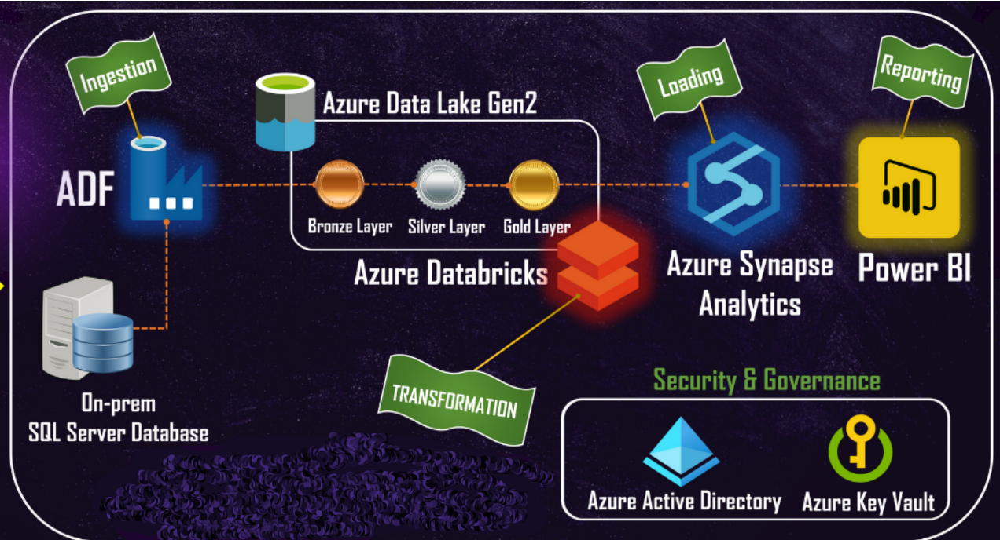

# AdventureWorks Sales Analysis | End-to-End Azure Data Pipeline

## Overview
This project demonstrates a comprehensive data engineering pipeline built on Azure Cloud. The pipeline covers the entire lifecycle of data—from ingestion and transformation to loading and reporting. The source data is the AdventureWorksLT2022 database, which is restored from a .bak file, and the final output is a set of interactive reports built in Power BI.

## Project Goals
1. **Connect On-Premise SQL Server with Azure Cloud**: Establish a secure connection between an on-premise SQL Server and Azure using Microsoft Integration Runtime.
2. **Ingest Data into Azure Data Lake**: Migrate tables from the on-premise SQL Server into Azure Data Lake Storage Gen2.
3. **Transform Data Using Azure Databricks**: Clean and process the ingested data through transformations in Databricks, moving it from a raw Bronze layer to a refined Gold layer.
4. **Load Data into Azure Synapse Analytics**: Load the transformed and cleaned data into Azure Synapse Analytics for efficient querying.
5. **Visualize Data with Power BI**: Create interactive dashboards and reports in Power BI connected to the Azure Synapse database.
6. **Implement Security and Monitoring**: Utilize Azure Active Directory (AAD) and Azure Key Vault to secure and monitor the data pipeline.

## Technologies Used
- **Data Source**: SQL Server
- **Orchestration**: Azure Data Factory
- **Storage**: Azure Data Lake Storage Gen2, Azure Synapse Analytics
- **Transformation**: Azure Databricks (PySpark)
- **Reporting**: Microsoft Power BI
- **Security**: Azure Active Directory, Azure Key Vault

## Project Architecture
The project architecture consists of several stages:

## Implementation Steps
### Part 1: Data Ingestion
1. **Restore AdventureWorksLT2022 Database**: Restore the database from a .bak file on the on-premise SQL Server.
2. **Set Up Integration Runtime**: Install and configure the Microsoft Integration Runtime to connect the on-premise SQL Server to Azure.
3. **Create ADF Copy Pipeline**: Set up a pipeline in Azure Data Factory to copy data from the on-premise SQL Server to Azure Data Lake Storage Gen2, storing it in Parquet format.

### Part 2: Data Transformation
1. **Mount ADLS in Databricks**: Mount the Azure Data Lake Storage to Databricks for data access.
2. **Bronze to Silver Transformation**: Clean the data and apply attribute type changes, saving the output to the Silver folder.
3. **Silver to Gold Transformation**: Apply consistent naming conventions and save the final data in the Gold folder in Delta format.

### Part 3: Data Loading
1. **Load Data into Synapse**: Use Azure Synapse Analytics to efficiently load and manage the cleaned data.
2. **Execute Stored Procedure**: Run a stored procedure in Azure Synapse to create or update views in the Azure SQL Database.

### Part 4: Data Reporting
1. **Connect Power BI to Synapse**: Set up a DirectQuery connection between Power BI and Azure Synapse to create real-time, interactive dashboards.
2. **Build Dashboards**: Create insightful visualizations to analyze sales data by product category, country, and customer demographics.

## Conclusion
This project showcases an end-to-end data engineering pipeline on Azure, from data ingestion and transformation to loading and reporting. It also highlights the importance of security and monitoring using Azure's native tools. The final product is a set of dynamic Power BI dashboards that provide valuable business insights.

